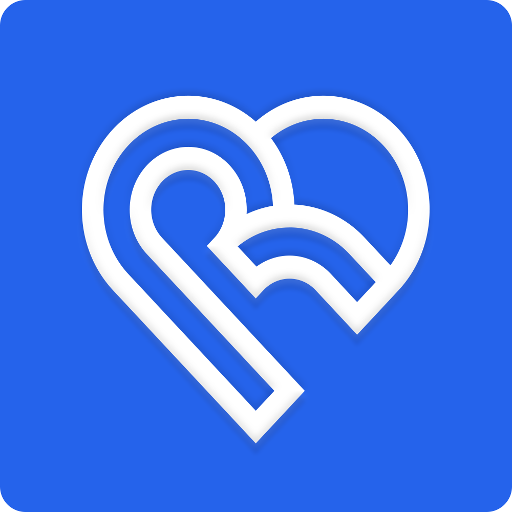

<a name="readme-top"></a>


<!-- PROJECT SHIELDS -->
[![Contributors][contributors-shield]][contributors-url]
[![Forks][forks-shield]][forks-url]
[![Stargazers][stars-shield]][stars-url]
[![Issues][issues-shield]][issues-url]
[![LinkedIn][linkedin-shield]][linkedin-url]


<!-- PROJECT LOGO -->
<br />
<div align="center">
  <a href="https://github.com/brendan-sadlier/reflectify">
    
  </a>

<h3 align="center">Reflectify</h3>

  <p align="center">
    All Your Thoughts, All in One Place.
    <br />
    <a href="https://github.com/brendan-sadlier/reflectify"><strong>Explore the docs »</strong></a>
    <br />
    <br />
    <a href="https://github.com/brendan-sadlier/reflectify">View Demo</a>
    ·
    <a href="https://github.com/brendan-sadlier/reflectify/issues/new?labels=bug&template=bug-report---.md">Report Bug</a>
    ·
    <a href="https://github.com/brendan-sadlier/reflectify/issues/new?labels=enhancement&template=feature-request---.md">Request Feature</a>
  </p>
</div>


<!-- TABLE OF CONTENTS -->
<details>
  <summary>Table of Contents</summary>
  <ol>
    <li>
      <a href="#about-the-project">About The Project</a>
      <ul>
        <li><a href="#built-with">Built With</a></li>
      </ul>
    </li>
    <li>
      <a href="#getting-started">Getting Started</a>
      <ul>
        <li><a href="#prerequisites">Prerequisites</a></li>
        <li><a href="#installation">Installation</a></li>
      </ul>
    </li>
    <li><a href="#usage">Usage</a></li>
    <li><a href="#roadmap">Roadmap</a></li>
    <li><a href="#contributing">Contributing</a></li>
    <li><a href="#license">License</a></li>
    <li><a href="#contact">Contact</a></li>
    <li><a href="#acknowledgments">Acknowledgments</a></li>
  </ol>
</details>


<!-- ABOUT THE PROJECT -->
## About The Project

[![Product Name Screen Shot][product-screenshot]](https://example.com)

<p align="right">(<a href="#readme-top">back to top</a>)</p>


### Built With

[![Next][Next.js]][Next-url]
[![React][React.js]][React-url]
[![ShadcnUI][ShadcnUI]][Shadcn-url]
[![Supabase][Supabase]][Supabase-url]
[![Prisma][Prisma]][Prisma-url]
[![Kinde][Kinde]][Kinde-url]

<p align="right">(<a href="#readme-top">back to top</a>)</p>


<!-- GETTING STARTED -->
## Getting Started

### Prerequisites

**npm**
  ```sh
  npm install npm@latest -g
  ```

**Supabase Account**

1. Go to [Supabase](https://supabase.io/) and create an account
2. Create a new project
3. Navigate to the project settings and copy the `DATABASE_URL` and `DIRECT_URL`

**Kinde Account**
1. Go to [Kinde](https://kinde.co/) and create an account
2. Create a new project
3. Navigate to the project settings and copy the `CLIENT_ID`, `CLIENT_SECRET`, and `ISSUER_URL`, `SITE_URL`, `POST_LOGOUT_REDIRECT_URL`, `POST_LOGIN_REDIRECT_URL`

### Installation

1. Clone the repo
   ```sh
    git clone https://github.com/brendan-sadlier/reflectify.git
   ```
2. Install NPM packages
   ```sh
    npm install
   ```
4. Create a `.env` file in the root directory and add the following:
   ```sh
    # Kinde Authentication
    KINDE_CLIENT_ID=
    KINDE_CLIENT_SECRET=
    KINDE_ISSUER_URL=

    KINDE_SITE_URL=
    KINDE_POST_LOGOUT_REDIRECT_URL=
    KINDE_POST_LOGIN_REDIRECT_URL=

    # Supabase
    DATABASE_URL=
    DIRECT_URL=
   ```
3. Start the project
   ```sh
    npm run dev
    ```
4. Open your browser and navigate to `http://localhost:3000/`

<p align="right">(<a href="#readme-top">back to top</a>)</p>


<!-- CONTRIBUTING -->
## Contributing

Contributions are what make the open source community such an amazing place to learn, inspire, and create. Any contributions you make are **greatly appreciated**.

If you have a suggestion that would make this better, please fork the repo and create a pull request. You can also simply open an issue with the tag "enhancement".
Don't forget to give the project a star! Thanks again!

1. Fork the Project
2. Create your Feature Branch (`git checkout -b feature/AmazingFeature`)
3. Commit your Changes (`git commit -m 'Add some AmazingFeature'`)
4. Push to the Branch (`git push origin feature/AmazingFeature`)
5. Open a Pull Request

<p align="right">(<a href="#readme-top">back to top</a>)</p>


<!-- DEVELOPER -->
## Developers

Brendan Sadlier - [LinkedIn](linkedin.com/in/brendan-sadlier-24672823a) - [Email](mailto:sadlier.brendan15@gmail.com)

<p align="right">(<a href="#readme-top">back to top</a>)</p>


<!-- MARKDOWN LINKS & IMAGES -->
<!-- https://www.markdownguide.org/basic-syntax/#reference-style-links -->
[contributors-shield]: https://img.shields.io/github/contributors/brendan-sadlier/reflectify.svg?style=for-the-badge
[contributors-url]: https://github.com/brendan-sadlier/reflectify/graphs/contributors
[forks-shield]: https://img.shields.io/github/forks/brendan-sadlier/reflectify.svg?style=for-the-badge
[forks-url]: https://github.com/brendan-sadlier/reflectify/network/members
[stars-shield]: https://img.shields.io/github/stars/brendan-sadlier/reflectify.svg?style=for-the-badge
[stars-url]: https://github.com/brendan-sadlier/reflectify/stargazers
[issues-shield]: https://img.shields.io/github/issues/brendan-sadlier/reflectify.svg?style=for-the-badge
[issues-url]: https://github.com/brendan-sadlier/reflectify/issues
[license-shield]: https://img.shields.io/github/license/brendan-sadlier/reflectify.svg?style=for-the-badge
[license-url]: https://github.com/brendan-sadlier/reflectify/blob/master/LICENSE.txt
[linkedin-shield]: https://img.shields.io/badge/-LinkedIn-white.svg?style=for-the-badge&logo=linkedin&colorB=0A66C2
[linkedin-url]: https://www.linkedin.com/in/brendan-sadlier-24672823a
[product-screenshot]: public/ReflectifyBanner.png

<!-- Built With -->
[Next.js]: https://img.shields.io/badge/next.js-000000?style=for-the-badge&logo=nextdotjs&logoColor=white
[Next-url]: https://nextjs.org/

[React.js]: https://img.shields.io/badge/React-20232A?style=for-the-badge&logo=react&logoColor=61DAFB
[React-url]: https://reactjs.org/

[ShadcnUI]: https://img.shields.io/badge/shadcnui-000000?style=for-the-badge&logo=styled-components&logoColor=white
[Shadcn-url]: https://shadcn/ui

[Supabase]: https://img.shields.io/badge/Supabase-1C1C1C?style=for-the-badge&logo=supabase&logoColor=3FCF8E
[Supabase-url]: https://supabase.io/

[Kinde]: https://img.shields.io/badge/Kinde-000000?style=for-the-badge
[Kinde-url]: https://kinde.co/

[Prisma]: https://img.shields.io/badge/prisma-2D3748?style=for-the-badge&logo=prisma&logoColor=white
[Prisma-url]: https://www.prisma.io/